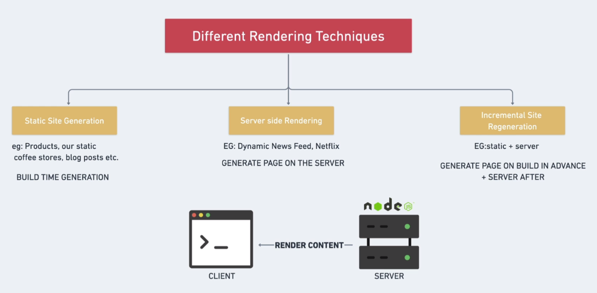
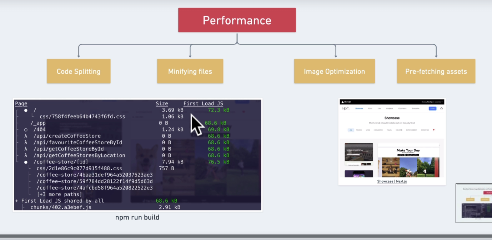

# Index

- [React](#react)
- [Benefits](#benefits)
  - [Different Rendering technoques](#different-rendering-technoques)
  - [Performance](#performance)
  - [File Based Routing](#file-based-routing)
  - [SEO](#seo)
- [Create Project](#create-project)
- [Project sctruct](#project-sctruct)
  - [pages](#pages)
    - [\_app](#--app)
    - [\_document](#--document)
    - [api](#api)
  - [public](#public)
  - [styles](#styles)
- [Routing](#routing)
  - [History API](#history-api)
  - [Dynamic Routers](#dynamic-routers)
  - [Link](#link)
- [Style](#style)
  - [Images](#images)
  - [Font](#font)

<small><i><a href='http://ecotrust-canada.github.io/markdown-toc/'>Table of contents generated with markdown-toc</a></i></small>

# React

about react in https://github.com/ncostamagna/react

# Benefits

## Different Rendering technoques

you can choose to render your content on the server or on the client


## Performance

- Code Splitting: divide your web app in small chunks
- Image oprimization: render imagen for especific viewport (pc, mobile, tablet)
  <br />



## File Based Routing

Router based by folder and files

## SEO

search engine optimization. You're making the life of bots easier to discover your content

# Create Project

https://nextjs.org/docs/basic-features/typescript

```sh
# create nextjs project with typescript
npx create-next-app@latest --ts

npm run dev # starts the developer server
npm run build # builds the app
npm start # runs the built app in production mode

```

Upgrade next version: https://nextjs.org/docs/upgrading <br />
If you want to upgrade, you'll see all details (in the documentation) for possible breaking changue. For example, in 12 next version the target field mustn't be in next.config.js file

# Project sctruct

## pages

default in index.js<br />

I only need create a file in page folder for can access in the page, the url must have the same name that the file.<br />
for example, if I create a home.tsx file then I'll see in /home path<br />

### \_app

entry point in our pages. we can put standars elements in the pages, for example, a footer

```tsx
function MyApp({ Component, pageProps }) {
  return (
    <div>
      <Component {...pageProps} />
      <footer>
        <p>My fuck footer</p>
      </footer>
    </div>
  );
}
```

when you need to add some Global Layout or Meta Tags

### \_document

Overwrite the Basic HTML structure, lets you edit only html code structure which means that you can't add javascript events in it.

### api

backend and server side code

## public

assets: images, icons, etc..

## styles

css files

- global.css: global css
- Home.module.css: local css in each modules, in this case only in Home component (if you import this css file in Home component)

# Routing

## History API

navigate the user back and forth between different pages, 3 differents routing

- index router: default root page
- nested files: /my-page ({nested - anidados})
- define brackets: /my-page/[id]

## Dynamic Routers

for example if we have a coffe-store/[id].js file in page folder.

We can user router.query for getting the id value

```ts
import {useRouter} from 'next/router'

const Store = () => {
  const router = useRouter()
  const {id} = router.query
  ...
}
```

## Link

We can use link for going to differents pages, without refresh the page.<br />
Only for internal next page

```ts
import Link from "next/link";

const SomePage = () => {
  return (
    <div>
      <Link href="/coffee-store/1234">
        <a>coffee store</a>
      </Link>
    </div>
  );
};
```

# Style

- global.css: global css
- Home.module.css: local css in each modules, in this case only in Home component (if you import this css file in Home component)

```css
/* Home.module.css file */
.container{
  display:flex
  align-items: center;
}
```

```ts
import styles from "../style/Home.module.css";

const Home = () => {
  return <div className={style.container}>...</div>;
};
```

## Images

We can use icons8.com for creating images, we can leave the image in public directory (we can create a static folder in public directory)<br />
We can use next/image in Next, the imagen will be optimizing.
NextJS'll optimice the images with less size and download the content on demand

```ts
import Image from "next/image";

const Home = () => {
  return (
    <div>
      <Image src="/static/my-img.png" width={700} height={400}></Image>
    </div>
  );
};
```

## Font

download in google fonts the ttf files and add these files in public/fonts<br />
How apply this fonts, we import this font in \_document file

```ts
import Document, { Head, Html, Main, NextScript } from "next/document";

class MyDocument extends Document {
  render() {
    return (
      <Html lang="en">
        <Head>
          <link
            rel="preload"
            href="/fonts/IBMPlexSans-Bold.ttf"
            as="font"
            crossOrigin="anonymous"
          ></link>
          <link
            rel="preload"
            href="/fonts/IBMPlexSans-Regular.ttf"
            as="font"
            crossOrigin="anonymous"
          ></link>
          <link
            rel="preload"
            href="/fonts/IBMPlexSans-SemiBold.ttf"
            as="font"
            crossOrigin="anonymous"
          ></link>
        </Head>
        <body>
          <Main></Main>
          <NextScript />
        </body>
      </Html>
    );
  }
}

export default MyDocument;
```

In order to make sure fonts get set correctly, you need to also use @font-face to apply those fonts correctly

```css
@font-face {
  font-family: "IBMPlexSans";
  font-style: normal;
  font-weight: 500;
  src: url(/fonts/IBMPlexSans-Regular.ttf) format("truetype");
}

@font-face {
  font-family: "IBMPlexSans";
  font-style: normal;
  font-weight: 600;
  src: url(/fonts/IBMPlexSans-SemiBold.ttf) format("truetype");
}

@font-face {
  font-family: "IBMPlexSans";
  font-style: normal;
  font-weight: 700;
  src: url(/fonts/IBMPlexSans-Bold.ttf) format("truetype");
}
```
